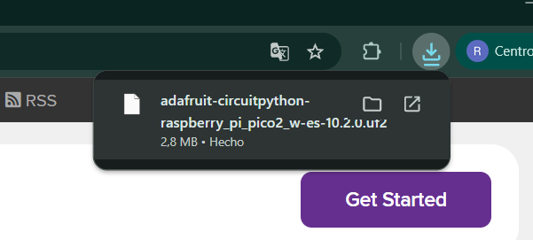

# sesion-08

lunes 27 abril 2026

SciPy

Micropython

Microcontroladores + Python

Circuitpython 10.2.0

https://circuitpython.org/

Borrar firmware a una Raspberry Pi

https://circuitpython.org/board/raspberry_pi_pico2_w/

Descarga de versión compatible con raspberry pi pico 2w, demoró 1 segundo

