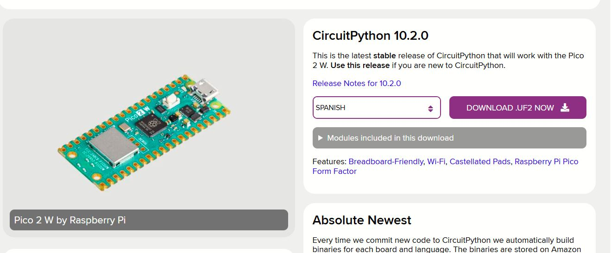
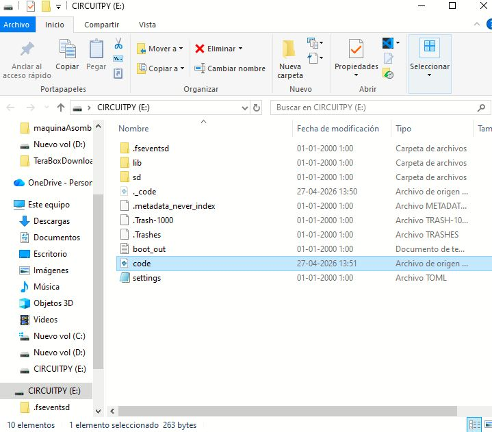
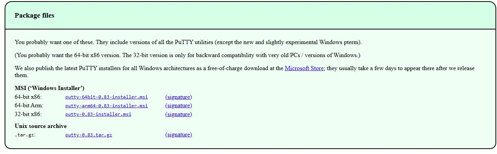
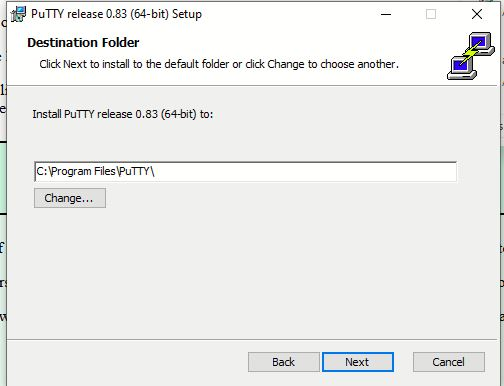
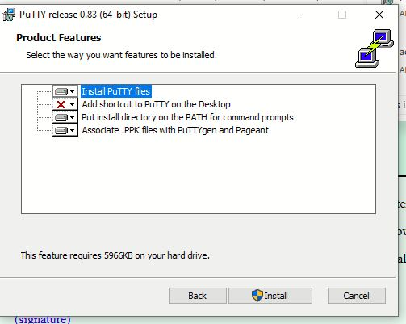
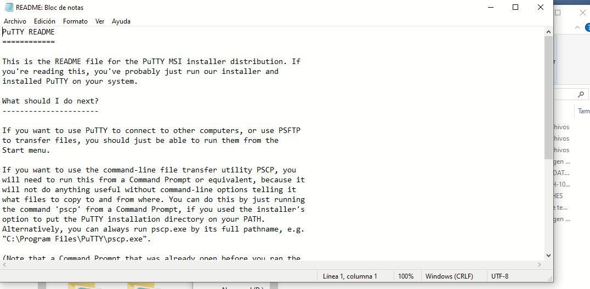
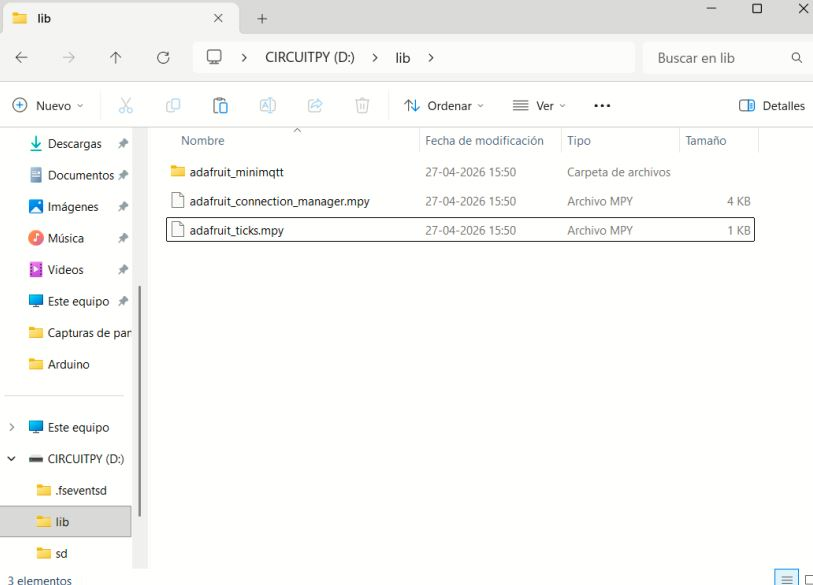
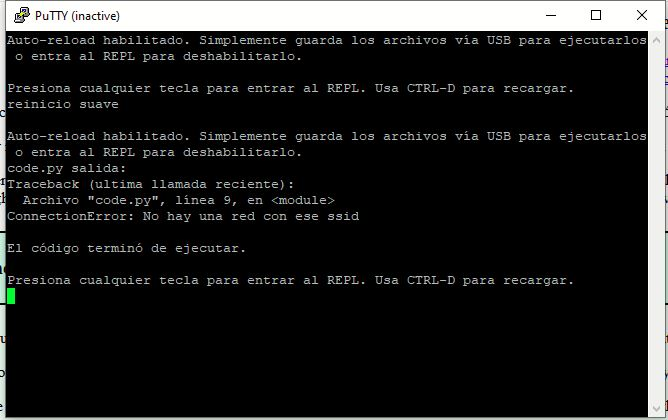
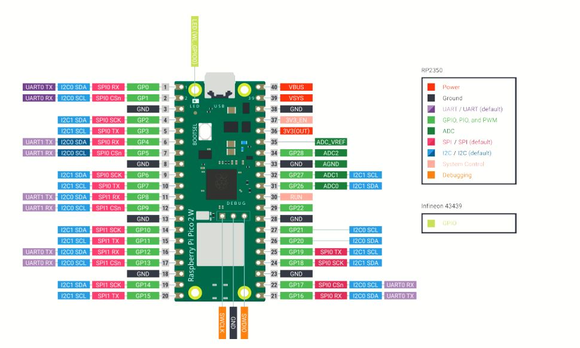
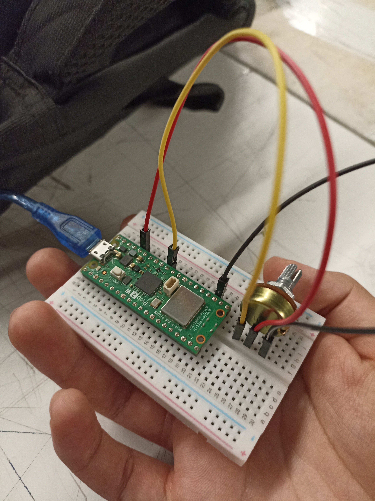

# sesion-08

lunes 27 abril 2026

nos vemos a la vuelta del receso

última clase antes del receso

llegué tarde, pucha

## primera parte

esta clase utilizaremos nuestra raspberry pi pero con python, no utilizaremos ni python ni micropython, utilizaremos circuitpython

hay muchos microcontroladores/placas que utilizan Circuitpython

utilizaremos circuitpython 10.2.0

en raspberry no hay terminal??

me perdí con la instalación y los comandos en la nueva terminal

mateo hermoso me ayudó, me prestó su raspi porque la que tengo se me quedó en la casa

descargamos 10.2.0, el archivo uf2

- se abrirá este archivo

- este archivo debemos arrastrarlo a la carpeta de circuitpy

- al arrastrar el archivo aquí, ya está dentro de nuestra raspberry y se incluye todo lo que trae

- ahora usaremos putty

**proceso de instalación y configuración de putty**

- descargamos la versión que aparece de las primeras

- quedé en cuando se abre el archivo readme del putty, me perdí brígido después de eso

- abrimos arduino y buscamos cual COM nos detecta al conectar la raspi

- en mi caso era COM 16, abrimos PUTTY

- en putty debemos apretar SERIAL y cambiar al COM que nos detectó en arduino, en este caso era **COM16**, cambiamos los baudios a 115200 y apretamos **SAVE**

-  descargar bibliotecas para circuitpython desde la página y meterlas en el archivo **LIB** de **CIRCUITPY** que se abre cuando conectamos la **RASPI**

- debemos descargar esto y extraerlo

- tenemos que meter 1 carpeta y 2 archivos dentro de nuestro archivo LIB en circuitpy, son los siguientes:

imagen sacada del discord, enviada por carla-nunez, no alcancé a registrar esto cuando tenía la raspberry en la sala y no me la traje de vuelta

- aparece esto en la terminal con putty al apretar ctrl d, no entendí mucho esto pero creo que estaba bien según lo que me dijo mateo

## BREAK Y PARTE 2

ahora enviaremos el potenciómetro a adafruit

- potenciómetro -> raspi -> adafruit io

¿cómo conectamos el potenciómetro a la raspi en la proto?

- seguimos el siguiente pinout de la raspi 2w que nos compartió Aarón

- queda conectado de esta forma

- descubrimos que los GND en la placa de raspi son cuadrados, todos los demás pines son círculos, detallitos

- ADC, capaz de convertir algo en análogo a digital, es como la patita A0 de arduino, por eso conectamos a ese lugar

**salí a la pizarra a probar el pote y si conectaba a los feeds de adafruit, no funcionó pero aprendimos cosas**

- nos conectamos a la red de aarón, algo importante que faltaba y que siempre hay que hacer es grabar el código, no debe aparecer un círculo arriba en el archivo, cuando aparece un círculo significa que no está grabado

**análisis del código de python**

- pool tiene que ver con el wifi, línea 13 le da las reglas al mqtt, aquí aparece el wifi y las llaves

- mqtt.connect() esta línea hace la magia de conectarse

- los comentarios en python son con # antes de lo que queremos comentar

- raspberry pi tiene otro rango para los valores de arduino en el potenciómetro, la línea 27 transforma la medida del potenciómetro en arduino a la medida de raspi, lo adapta por así decirlo:   value= pot value * 1023//65535, es una conversión, no una división

- repasar estas cosas, cranear una presentación bonita para la solemne 2

- code.py es el principal, aquí es donde corre el código

**17:28 agregar corrección del pote, parece que el nuestro estaba bien pero igual salió olor a quemado, los potes al manejarse entre dos extremos pueden generar cortocircuito, es una jugada arriesgada**

 

cambiaremos el código interno de la raspberry para poder conectarla a nuestro celular, etc

