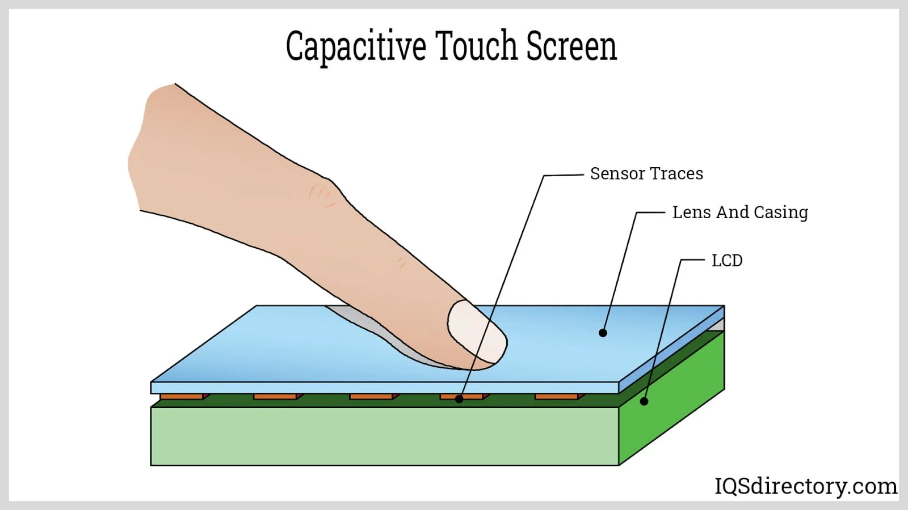
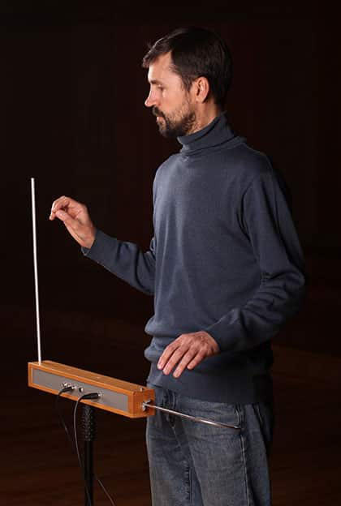

# sesion-06

lunes 13 abril 2026

## Capacitancia

Segun Gemini: La capacitancia es la capacidad de un componente, generalmente un capacitor o condensador, para almacenar energía en forma de carga eléctrica por unidad de diferencia de potencial o voltaje aplicado. Se define por la fórmula 𝐶=𝑄/𝑉, donde la unidad de medida es el Faradio (F). El valor depende de la estructura física del componente, como el área de las placas y el material aislante (dieléctrico) entre ellas.

Como usar capacitancia como una manera de medir distancia.



<https://docs.arduino.cc/tutorials/uno-r4-wifi/touch/>

Usaremos la biblioteca: Arduino_CapacitiveTouch library.

## Arduino UNO R4 WiFi

| Arduino Pin | Touch Sensor Channel (TS#) | Channel Control Index (CHAC idx) | Channel Control Bit Mask (CHAC val) |
|------------|----------------------------|----------------------------------|-------------------------------------|
| D0         | 9                          | 1                                | (1 << 1)                            |
| D1         | 8                          | 1                                | (1 << 0)                            |
| D2         | 13                         | 1                                | (1 << 5)                            |
| D3         | 34                         | 4                                | (1 << 2)                            |
| D6         | 12                         | 1                                | (1 << 4)                            |
| D8         | 11                         | 1                                | (1 << 3)                            |
| D9         | 2                          | 0                                | (1 << 2)                            |
| D11        | 7                          | 0                                | (1 << 7)                            |
| D12        | 6                          | 0                                | (1 << 6)                            |
| A1 (D15)   | 21                         | 2                                | (1 << 5)                            |
| A2 (D16)   | 22                         | 2                                | (1 << 6)                            |
| LOVE_BUTTON| 27                         | 3                                | (1 << 3)                            |

Código de ejemplo:

```cpp
#include "Arduino_CapacitiveTouch.h"

CapacitiveTouch touchButton = CapacitiveTouch(D0);

void setup() {
  Serial.begin(9600);

  if(touchButton.begin()){
    Serial.println("Capacitive touch sensor initialized.");
  } else {
    Serial.println("Failed to initialize capacitive touch sensor. Please use a supported pin.");
    while(true);
  }

  touchButton.setThreshold(2000);
}

void loop() {
  int sensorValue = touchButton.read();
  Serial.print("Raw value: ");
  Serial.println(sensorValue);

  if (touchButton.isTouched()) {
    Serial.println("Button touched!");
  }

  delay(100);
}
```

### Theremin

El theremin es el primer instrumento musical electrónico, inventado en 1920 por Leon Theremin, que se caracteriza por tocarse sin contacto físico. Utiliza dos antenas para controlar el tono (mano derecha) y el volumen (mano izquierda) mediante el movimiento de las manos en el aire dentro de un campo electromagnético.



Código modificado en clase:

```cpp
#include <Arduino_CapacitiveTouch.h>


// referencia
// https://docs.arduino.cc/tutorials/uno-r4-wifi/touch/
// por montoyamoraga para disenoUDP
// dis9079
// abril 2026
// funciona con Arduino Uno R4
// wifi o minima
// usar biblioteca Capacitive_Touch

// importar biblioteca
#include "Arduino_CapacitiveTouch.h"

// existe un constructo
// del tipo CapacitiveTouch
// que se llama touchButton, ese nombre es de fantasia
// esta conectada a la patita D0
CapacitiveTouch touchButton = CapacitiveTouch(D0);

// valor de lectura
int valorLectura = 0;

// valores min y max
// que partan en el peor caso posible
int minLectura = 100000;
int maxLectura = 0;


// setup() ocurre al principio una vez
void setup() {
  // prende el puerto serial
  // la velocidad es importante
  Serial.begin(9600);

  // touchButton
  // despues viene un punto
  // ese punto es como hacer doble click
  // es como entrar
  // dentro hace begin() que lo inicializa
  // el if hace que si lo logra pase algo
  // y si no, pase otra cosa
  if (touchButton.begin()) {
    Serial.println(":) yay");
  } else {
    Serial.println("oh no :'( snif");
    // quedarse pegado ante el fracaso
    while (true)
      ;
  }

  // define el umbral o threshold
  // en 2000
  // lo que de inmediato me hace preguntarme
  // oh no
  // cuanto es el valor minimo posible
  // cuanto es el valor maximo posible
  // cuando terminara este calvario
  // por que 2000?
  // en california funciona?
  // y en este frio otono de santiago
  // que hago
  // quien soy
  // etc
  touchButton.setThreshold(2000);
}

// loop() ocurre en bucle
// despues de setup()
// hasta el fin de los tiempos
void loop() {

  // asignar a valorLectura
  // el resultado de preguntarle a touchButton
  // cuanto vale
  // read() me da el valor crudo
  valorLectura = touchButton.read();

  // actualizar valores min y max
  if (valorLectura < minLectura) {
    // actualiza el minimo con uno mejor
    minLectura = valorLectura;
  }

  if (valorLectura > maxLectura) {
    // actualizar el maximo con uno mejor
    maxLectura = valorLectura;
  }


  Serial.print("Valor crudo: ");
  // imprime valor lectura
  Serial.println(valorLectura);

  Serial.print("min: ");
  Serial.print(minLectura);
  Serial.print(", max: ");
  Serial.println(maxLectura);


  // se pregunta con if
  // si el boton esta siendo tocado
  if (touchButton.isTouched()) {
    // si lo esta, imprime
    Serial.println("hubo contacto");
  }

  // usar mi min y max para tomar conclusiones
  // tomo el valor promedio entre min y max
  // y si mi valor actual es mayor que eso
  // digo oh estoy por sobre el promedio
  if (valorLectura > (minLectura + maxLectura)/2) {
    Serial.println("sobre el promedio, dab");
  }

  // deja tu vida atras
  // suspendela, en pausa
  // cierra los ojos por 100 ms = 0.1 s
  // ignora todo lo que esta pasando
  // para que no ocurra tan rapido todo
  delay(100);
```
