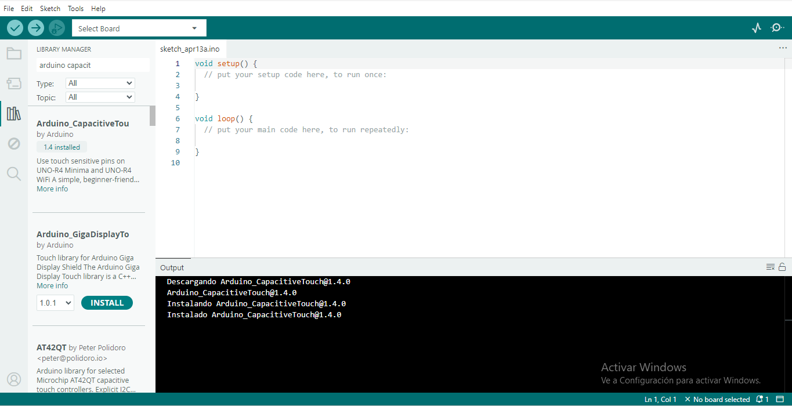

# sesion-06

lunes 13 abril 2026

## primer bloque de clases

En este primer bloque aplicamos el feedback recibido y comenzamos a realizar las correcciones correspondientes. Principalmente, trabajamos en la bitácora grupal, donde mejoramos la explicación del proceso para que fuera más clara y completa. Además, corregimos un error en la incorporación de imágenes, ya que inicialmente estaban mal subidas en el código, por lo que se ajustó su formato y visualización dentro del documento:)

## segundo bloque de clases

instalamos la libreria [Arduino_Capacitivetou](https://github.com/arduino-libraries/Arduino_CapacitiveTouch)  

